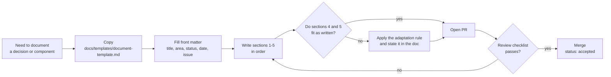

# Documentation Standard

Every document in this repository is written with the **same five sections, in the same
order**. This page defines those sections, when a section may be adapted, and how a
document is reviewed.

Applies to: everything under `docs/`, plus module READMEs. It does not apply to
auto-generated output (OpenAPI, Javadoc, coverage reports).

---

## 1. Why this decision

Documentation in a project like this one rots for a predictable reason: it describes
**what** the code does, which the code already says, and never records **why** it does it
that way — which the code cannot say. Six months later the reasoning is gone, the
trade-off is re-litigated from scratch, and the doc is deleted as "outdated".

This project also spans three fronts (`api`, `web`, `infra`) plus an AI integration whose
behaviour is not obvious from reading a class. A contributor landing on any single
document needs the same things every time: the reason, the payoff, the mechanism, a
concrete payload they can copy, and a picture of how the pieces connect.

Fixing the *shape* of a document — rather than leaving it to whoever writes it — makes
that predictable. The alternative considered was "free-form docs, reviewed case by case";
it was rejected because review then argues about structure instead of content, and
because nothing tells an author when a doc is finished.

## 2. Gains and trade-offs

**Gains**

- A reader can skim any document and find what they need at a fixed position.
- The rationale is captured while it is still fresh, not reconstructed later.
- The JSON example is copy-pasteable into `curl`/Postman, so it is *tested by use*:
  when the contract drifts, the example breaks and someone notices.
- Mermaid diagrams render natively on GitHub and live in the diff — no binary image
  assets to go stale, and a diagram change is reviewable.
- "Is this doc done?" becomes a checklist, not an opinion.

**Trade-offs**

- Writing overhead per document. Mitigated by `docs/templates/document-template.md`,
  which is a copy-paste skeleton.
- Risk of ceremony: sections filled in with filler text to satisfy the rule. Section 6
  below defines the escape hatch so nobody has to invent a fake JSON payload.

## 3. How it works

Every document has these five sections, in this order, with these headings:

| # | Heading | Required | What goes in it | Fails review when |
|---|---------|----------|-----------------|-------------------|
| 1 | `Why this decision` | always | The problem, the constraint, the alternatives considered and why they lost | It restates the title, or lists only what was built |
| 2 | `Gains and trade-offs` | always | The concrete payoff **and** what it costs | Only upsides are listed |
| 3 | `How it works` | always | The mechanism: components, flow, configuration, failure behaviour | It is a paraphrase of the code line by line |
| 4 | `Example` | always (adaptable) | A real input and the resulting output, as JSON | Fields are invented or the output doesn't match the input |
| 5 | `Diagram` | always (adaptable) | A `mermaid` block showing the flow or structure described in section 3 | It duplicates the table of contents instead of showing the mechanism |

**Front matter.** Each document opens with a YAML block:

```yaml
---
title: <human-readable title>
area: api | web | infra        # the same three verticals used for issue labels
status: draft | accepted | superseded
date: YYYY-MM-DD
issue: <issue number, if any>
---
```

**Where files live.**

- `docs/adr/NNNN-kebab-title.md` — architecture decisions (numbered, never renumbered;
  a reversed decision gets `status: superseded` and a link to the one replacing it)
- `docs/api/`, `docs/web/`, `docs/infra/` — component and feature docs
- `docs/templates/` — the skeletons
- File names are kebab-case `.md`; the `title` in the front matter is the display name.

**Language.** English, matching the issues and commit messages.

**Cross-links.** Reference other documents by relative path and issues by `#N`.

## 4. Example

Section 4 of a document is a real request and its real response. For an HTTP endpoint it
looks like this — a chat completion routed through the API:

**Input** — `POST /api/v1/chat`

```json
{
  "conversationId": "9f1c2a10-3b47-4f2e-9a1d-6c0b8e4d2f11",
  "model": "llama3.1:8b",
  "message": "Summarize the last deploy incident."
}
```

**Output** — `200 OK`

```json
{
  "conversationId": "9f1c2a10-3b47-4f2e-9a1d-6c0b8e4d2f11",
  "reply": "The 14:02 deploy rolled back after the health check failed twice.",
  "telemetry": {
    "model": "llama3.1:8b",
    "provider": "ollama",
    "promptTokens": 128,
    "completionTokens": 42,
    "latencyMs": 1830,
    "traceId": "4bf92f3577b34da6a3ce929d0e0e4736"
  }
}
```

Rules for this section: use realistic values (no `"foo"`/`"string"`), keep ids consistent
between input and output, redact secrets, and show the error shape too when the failure
case is part of the point.

## 5. Diagram



---

## 6. When a section does not fit

Sections 1-3 are never optional. Sections 4 and 5 may be **adapted, never dropped**:

- **No HTTP payload** (an infra or tooling doc): section 4 shows a different concrete
  input/output pair — a `docker compose` command and its resulting service state, an env
  var set and the config it produces, a CLI invocation and its output. JSON when the data
  is structured; a fenced block of the real thing otherwise.
- **Nothing to draw as a flow**: use another mermaid type that fits — `sequenceDiagram`
  for a multi-service interaction, `erDiagram` for a data model, `stateDiagram-v2` for a
  lifecycle, `C4Context` for a system boundary.
- If a section genuinely cannot apply, keep the heading and write one line saying why.
  An empty heading with a reason is reviewable; a missing heading is invisible.

## 7. Review checklist

A documentation PR is approved when:

- [ ] Front matter is present and complete
- [ ] The five headings appear, in order
- [ ] Section 1 names at least one alternative that was rejected, and why
- [ ] Section 2 states at least one cost or limitation
- [ ] Section 3 covers failure/error behaviour, not just the happy path
- [ ] Section 4's example is realistic and internally consistent
- [ ] Section 5's mermaid block renders (check the GitHub preview)
- [ ] The file is in the right folder with a kebab-case name
- [ ] Any adaptation of sections 4 or 5 is stated explicitly
