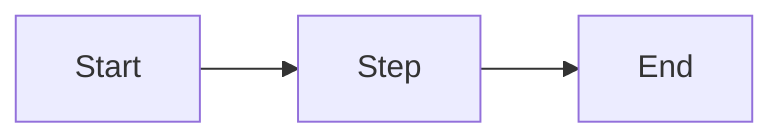

# <Human-readable title>

<One or two sentences: what this document covers and who should read it.>

## 1. Why this decision

<The problem or constraint that forced a decision. What was tried or considered instead,
and why it lost. Not a description of what was built — the reason it was built this way.>

## 2. Gains and trade-offs

**Gains**

- <Concrete payoff, ideally observable: fewer steps, faster feedback, a class of bug made impossible.>

**Trade-offs**

- <What this costs: complexity, runtime overhead, lock-in, extra maintenance — and how it is mitigated.>

## 3. How it works

<The mechanism. Components involved, how a request or process flows through them,
relevant configuration and environment variables, and what happens when it fails.>

## 4. Example

**Input** — `<METHOD /path, command, or config change>`

```json
{
}
```

**Output** — `<status or resulting state>`

```json
{
}
```

<If this is not an HTTP endpoint, use the equivalent concrete input/output pair — command
and resulting state, config and produced behaviour — and say so in one line.>

## 5. Diagram



<Pick the type that fits: flowchart, sequenceDiagram, erDiagram, stateDiagram-v2, C4Context.>
